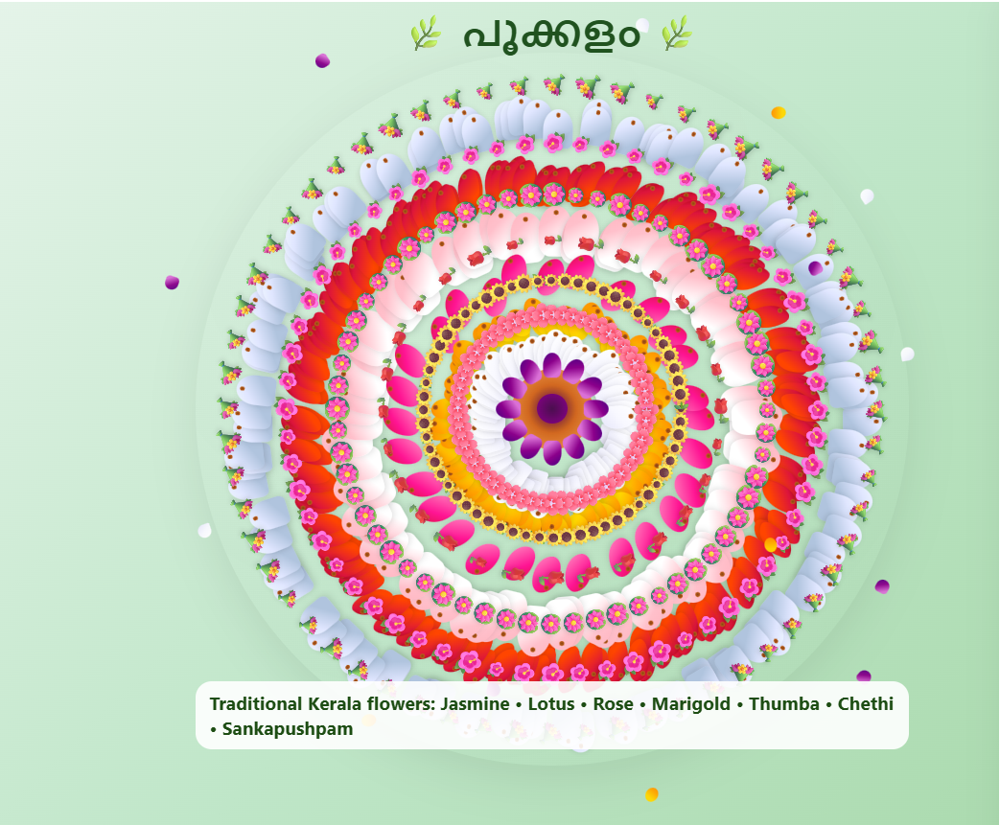

# 🌸 Code-a-Pookkalam 🌸

A digital version of the traditional **Onam Pookkalam** 🪷, created entirely using **HTML, CSS, and JavaScript**.  
This project lets you experiment with petal arrangements, emoji borders, and concentric rings — bringing the festival spirit online! 🎉

---

## 🌿 Live Demo
👉 [View my Pookkalam here](https://your-username.github.io/code-a-pookkalam/)  
*(replace `your-username` and repo name once GitHub Pages is enabled)*

---

## 🖼️ Preview
  
*(Take a screenshot of your design, save it as `screenshot.png` in the repo root, and it will show up here)*

---

## ✨ Features
- Interactive sliders to adjust petal counts  
- Emoji borders around each ring 🌸🌻🌹🪷🌺💐  
- Randomize button for surprise patterns 🎲  
- Beautiful green background inspired by Onam traditions 🌿  
- Works directly in the browser, no installation needed  

---

## 📂 Project Structure
